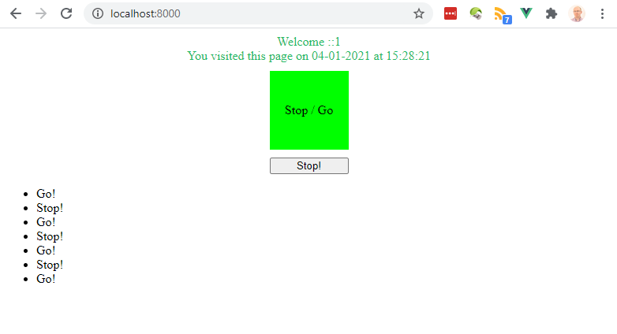

# PHP Vue.js test

## Purpose

A very small web test app consisting of a PHP file combined with a Vue.js instance.

The initial data for the Vue.js app is provided by the PHP back-end.

## Steps

### Preparation

To write this test app, I assume you have:
- use [PHPSandbox](https://phpsandbox.io/), an online PHP code editor & test environment (use the "Standard PHP notebook with Web and CLI" notebook option for this test)
- or installed a local copy of PHP 7.4 on your machine

### PHP

- create a blank .php page
- get the current Unix timestamp in `$timestamp`
- create an associative $data array in PHP containing the following keys:
  - a random RGB color in `randomColor` in hexadecimal color format #123456 (a one-liner!)
  - the remote ip address of the client browser in `remoteIp`
  - the date portion of `$timestamp` in `date` using format DD-MM-YYYY
  - the time portion of `$timestamp` in `time` using format HH:MM:SS
  - an empty string `color`
  - an empty string `buttonText`
  - a falsy boolean `go`
  - an empty array `log`

### Vue.js

- add the Vue.js runtime to your PHP page from the standard CDN
- create a Vue.js instance in your PHP page
- use the PHP $data array as the Vue.js data object (in such a way you are able to add extra JS properties in the data object at the same level)
- initialize the `color` property in the data object to `red` (in Vue.js, not PHP)
- init `buttonText` property to "`Go!`"
- create an html box with (id = `box1`), width 80%, centered horizontally on the page, text centered
- bind the text color of box1 to the Vue.js data variable `randomColor`
- the html box must contain the text (assuming a client ip 192.168.0.20 visited the page on 02-01-2021 at 15:20:33):
  - line 1: "Welcome 192.168.0.20!"
  - line 2: "You visited this page on 02-01-2021 at 15:20:33"
- add another box (id = `box2`) of 100px x 100px, top & bottom margin 10px, centered on the page, all content centered horizontally & vertically
- box2 text content: "Stop / Go"
- bind it's background color to `color`
- add a third box (id = `box3`) with a button (id = `go`) toggling the color of box2 between red and green
- when box2 is red, the button text must be "Go!"
- when box2 is green, the button text must be "Stop!"
- the button must be 100px wide and centered in box3
- add a `<ul>` tag below box3, adding a new `<li>` tag with the current buttonText to the `<ul>` tag on every click of the toggle button using the `log` data property in Vue.js

## Key points & tips

- keep your code (layout) as clean and readable/maintainable as possible
- separate business logic from layout in html/css 
- use the latest language constructs/functions/properties in PHP, JS, HTML & CSS
- take issues with async page startup into account

## Test environment

If you have a local copy of PHP 7.4, start a local PHP server on port 8000 in your project's directory:
```
# php -S localhost:8000
```
In your browser, go to `http://localhost:8000`

In case you use the [PHPSandbox](https://phpsandbox.io/) online, you can test your app immediately online there

## Example screenshot

